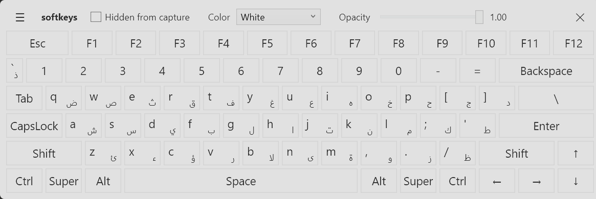

# softkeys

**A freeze-proof on-screen keyboard for Windows 11 — invisible to screenshots, never steals focus, zero network code.**



## Why this exists

The built-in Windows On-Screen Keyboard (`osk.exe`) froze on me about six times per session — and near-100% reproducibly the moment I took a screenshot with the Snipping Tool, locking up for around a minute each time. The cause is architectural: OSK is a UI Automation client that synchronously queries other processes (the focused app, capture overlays, the Text Services Framework), and when any of them doesn't answer, OSK's UI thread blocks until the timeout expires.

softkeys exits that design category entirely. It is a **stateless input emitter**: it never queries any other process. It draws keys; when you press one, it injects the event with `SendInput` and moves on. There is no cross-process call anywhere in the input path — so there is nothing to freeze on.

## Features

- **Invisible to screenshots and recordings** (toggleable) — uses `SetWindowDisplayAffinity(WDA_EXCLUDEFROMCAPTURE)`, so the keyboard never appears in your captures. The built-in OSK can't do this.
- **Never steals focus** — `WS_EX_NOACTIVATE`: clicking keys types into your app; your app stays active the whole time.
- **Works with any keyboard layout, including RTL** — keys inject *scan codes*, so the active Windows layout decides the character. Switch to Arabic and the letter keys produce Arabic; no configuration.
- **Dual-script keycaps** — every key that differs under the Arabic (101) layout shows both glyphs (Latin top-left, Arabic bottom-right), always visible. No layout detection, no switching — the cap already tells you what each layout will type.
- **Case-aware labels with a CapsLock indicator** — letter caps show lowercase or uppercase to match what will actually be typed (Shift XOR CapsLock, like a real keyboard), and the CapsLock key highlights while active.
- **English word suggestions** — as you type, a strip under the keys offers up to three completions of the current word, most frequent first; tap one and only the missing letters are sent. It works from a *shadow buffer* of what softkeys itself typed — it never reads the target application, which is the whole reason this keyboard doesn't freeze. Completion only: suggestions are **append-only**, so softkeys never emits Backspace or Delete on its own, and if the buffer ever drifts out of sync the worst case is a few unwanted letters, never lost text. Toggle it under ☰.
- **Function row** — permanent `Esc` + `F1`–`F12` row that participates in sticky-modifier chords: arm Alt, tap F4.
- **Freeze-proof by design** — no UI Automation, no hooks into other processes, no caret tracking, no TSF.
- **Zero network code** — no telemetry, no update checks, no sockets. Auditable in minutes; the source is small.
- **Portable exe or per-user installer** — self-contained .NET 8, no prerequisites, no admin rights either way; the installer never shows a UAC prompt, and uninstalling keeps your settings by default.
- Sticky modifiers (tap Shift/Ctrl/Alt/Win to arm, auto-release after the next key), shift-aware key labels, hold-to-repeat, adjustable color and opacity with automatic text contrast, resizable with proportional key scaling, minimize to the taskbar, immunity to Windows Snap (edge drags just move the window), settings persisted between sessions. A `Del` key sits at the right end of the Shift row, beside `↑`.

## Install

**Installer:** download `softkeys-setup.exe` from the [latest release](../../releases/latest) and run it. Per-user install to `%LOCALAPPDATA%\Programs\softkeys` — no admin rights, no UAC prompt at any point. You get a Start Menu entry and an Apps & Features listing; a desktop shortcut and "start when I sign in" are optional and off by default. `/SILENT` and `/VERYSILENT` are supported. Uninstalling keeps your settings unless you explicitly choose to remove them.

**Portable:** download `softkeys.exe` and run it. No installation, no admin rights.

Verify the hashes (published in the release notes; for v1.3.0):

```
certutil -hashfile softkeys.exe SHA256
  45c199c1cd0029c39ec596d87428ae4c056def1dc4cee3d5247b01d5ba270804
certutil -hashfile softkeys-setup.exe SHA256
  eef298ec370b5c6ec4a3eac188c30f073e6d20a44a3ae9475ea537e76b49894b
```

**SmartScreen note:** both the exe and the installer are unsigned (code-signing certificates cost real money; this is a free tool). Windows may warn on first run — "More info → Run anyway." If you'd rather not trust a downloaded binary, build both yourself (below); the source is short enough to read in one sitting, and the zero-network-code claim is verifiable there.

## Build from source

Requires the .NET 8 SDK.

```
git clone https://github.com/NasserAlh/softkeys.git
cd softkeys
dotnet publish -c Release -r win-x64 --self-contained -p:PublishSingleFile=true
```

The exe lands in `bin/Release/net8.0-windows/win-x64/publish/`.

Run the built-in self-test (structural checks on the injection layer, key map, and settings):

```
softkeys.exe --selftest
```

To build the installer as well (requires [Inno Setup 6](https://jrsoftware.org/isinfo.php); a user-scope install is fine):

```
powershell -ExecutionPolicy Bypass -File installer\build.ps1
```

This publishes the exe, compiles `installer/output/softkeys-setup.exe`, and prints both SHA-256 hashes.

## Usage

- **☰** in the header bar shows/hides the settings (capture invisibility toggle, word suggestions, background color, opacity).
- **—** minimizes to the taskbar; clicking the taskbar icon restores it — the keyboard still never takes focus.
- **Drag the title strip** to move; **drag any edge or corner** to resize — keys scale proportionally.
- **Modifiers are sticky:** tap Shift, then a letter → one shifted character, Shift releases itself. Tap an armed modifier again to cancel it (nothing is typed). Win works as a chord: arm Win, tap E → Explorer.
- Settings are saved to `%APPDATA%\softkeys\settings.json`. Delete the file to reset; a corrupt file is silently replaced with defaults.

## Limitations (by design)

- Can't type into **elevated (admin) windows** — Windows blocks input from standard-user processes into elevated ones (UIPI). Run softkeys elevated yourself if you need this.
- Some games with anti-cheat ignore injected input.
- With capture invisibility ON, the keyboard is also invisible in **screen sharing** — toggle it off when presenting.
- A bare Win-key tap can't open the Start menu (the sticky-latch model only injects modifiers as part of a chord); the Start button is one click away anyway.
- Arabic keycaps show the base (unshifted) glyph only — shifted Arabic characters (diacritics, tatweel, …) type correctly but aren't printed on the caps; three glyphs per key would hurt readability.
- The CapsLock indicator refreshes on interaction with the keyboard (after each key and on pointer-enter), not on a timer — toggle CapsLock on the physical keyboard while softkeys is idle and the indicator catches up at your next hover or click. A polling timer is exactly the kind of background chatter this project avoids.
- Word suggestions are **completion only, English only**. Nothing is ever corrected: "teh" is not changed to "the", and softkeys never deletes on its own. Suggestions are hidden while an Arabic word is being typed.
- The suggestion dictionary is ranked from **public-domain literature** (Project Gutenberg), which skews slightly literary — the ranking favours narrative vocabulary over conversational usage, and rare modern terms can be missing. The shipped list is 30,000 words; see [`docs/softkeys-v1.4-amendment.md`](docs/softkeys-v1.4-amendment.md) for how it is built and how to regenerate it.

## Credits

softkeys began as a Windows reimplementation of **[vboard](https://github.com/mdev588/vboard)** by **mdev588** — a virtual keyboard for Linux (now archived). The layout, sticky-modifier behavior, color palette, and general spirit come from vboard; the original `vboard.py` is preserved in [`reference/`](reference/) under its LGPL-2.1 license. Thank you, mdev588.

The Windows implementation was developed with an AI-assisted, gated SDLC process — requirements, design decisions, risk register, and acceptance tests are all in [`docs/softkeys-sdlc.md`](docs/softkeys-sdlc.md), which some readers may find as interesting as the code.

The word-suggestion dictionary is built entirely from public-domain material: vocabulary filtered against the [dwyl/english-words](https://github.com/dwyl/english-words) list (Unlicense / public domain), ordered by frequency counted over public-domain [Project Gutenberg](https://www.gutenberg.org/) prose. No third-party frequency data is redistributed — in particular, none of the commonly-used Google-derived word-frequency lists, which carry research-only licensing or unclear provenance. The generator is [`tools/DictionaryBuilder`](tools/DictionaryBuilder) and the built list is committed, so a clone needs no network access to build.

## License

LGPL-2.1 — same as the original vboard. See [LICENSE](LICENSE).

## Contributing

Issues and PRs are welcome. This is a personal tool maintained as time allows — no promises on response time. Please run `--selftest` and test on a real Windows 11 machine before submitting.
